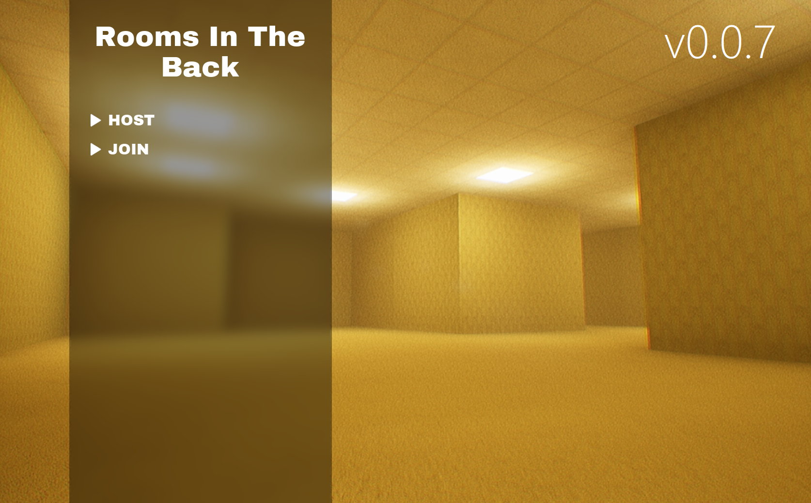

After a month and 2 mental breakdowns, version v0.0.8 is finally out!

## Changes

- Level1 got a whole lot more realistic thanks to Lumen and Nanite (that does not mean it's finished, it's not even near)
    - 
    - 
- Poolrooms now use Lumen, which was just for testing, and it will be removed in the next update if I don't forget to do it (stationary lighting looks just as good and it's much faster)
- Enabled Nanite Tesselation that broke Linux compatibility, but noone cares about the game anyway, so it's fine for now
- Rewritten Character Movement in C++, which massively decreased rubberbanding :eyes:
- Improved camera shakes
- Main Menu redesign
    - 
    - 
- Some other things I forgot about
